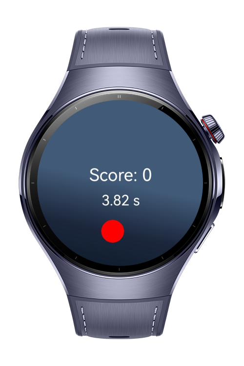
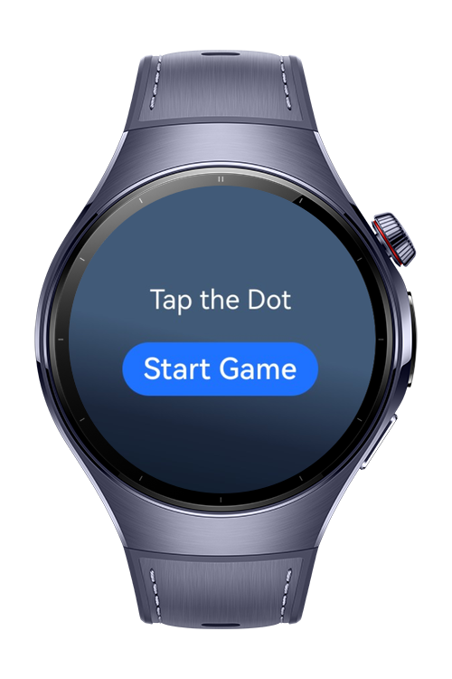

> **Note:** To access all shared projects, get information about environment setup, and view other guides, please visit [Explore-In-HMOS-Wearable Index](https://github.com/Explore-In-HMOS-Wearable/hmos-index).

# Tap The Dot Game
Tap The Dot is a reflex-based game built for HarmonyOS devices. The goal is simple: tap the dot as quickly as possible when it appears on screen. The game tests your reaction time and gets progressively more difficult as you play.

# Preview
<div>


</div>


# Use Cases:
- Simple, addictive gameplay
- Progressive difficulty - timer gets shorter as you play
- Score based on reaction time
- Clean, minimalist UI with gradient background
- Players start the game by pressing "Start Game"
- A dot appears randomly on screen
- Player must tap the dot as quickly as possible
- Points are awarded based on reaction time (faster = more points)
- Every 5 successful taps, the time limit decreases
- Game ends when time runs out

# Tech Stack
- **Languages**: ArkTS, ArkUI
- **Frameworks**: HarmonyOS SDK 5.0.2(14)
- **Tools**: DevEco Studio Vers 5.1.0.820
- **Libraries**: @kit.ArkUI

# Directory Structure
```
entry/src/main/ets/
|---compenents                    
|   |---GameComponent.ets         // Main gameplay component
|---services                     
|   |---TimerService.ets          // Timer implementation
|---states                        
|   |---GameState.ets             // Game state management
|---pages
|   |---Index.ets                 // Entry page with game controls
|---entryability                  // Application entry point
|---entrybackupability            // Backup functionality
|---resources
    |---base/media                // Application assets
        |---dot.png               // The dot image players tap
```

# Constraints and Restrictions
## Supported Device
- Huawei watch 5

# LICENSE
**Tap the dot game** is distributed under the terms of the MIT License.
See the [LICENSE](/LICENSE) for more information.